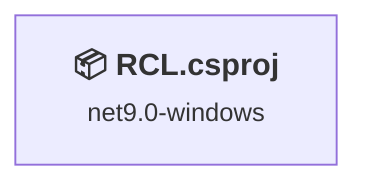
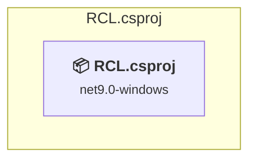

# Projects and dependencies analysis

This document provides a comprehensive overview of the projects and their dependencies in the context of upgrading to .NETCoreApp,Version=v10.0.

## Table of Contents

- [Executive Summary](#executive-Summary)
  - [Highlevel Metrics](#highlevel-metrics)
  - [Projects Compatibility](#projects-compatibility)
  - [Package Compatibility](#package-compatibility)
  - [API Compatibility](#api-compatibility)
- [Aggregate NuGet packages details](#aggregate-nuget-packages-details)
- [Top API Migration Challenges](#top-api-migration-challenges)
  - [Technologies and Features](#technologies-and-features)
  - [Most Frequent API Issues](#most-frequent-api-issues)
- [Projects Relationship Graph](#projects-relationship-graph)
- [Project Details](#project-details)

  - [ReaLTaiizor.UI\RCL.csproj](#realtaiizoruirclcsproj)

## Executive Summary

### Highlevel Metrics

| Metric | Count | Status |
| :--- | :---: | :--- |
| Total Projects | 1 | All require upgrade |
| Total NuGet Packages | 1 | All compatible |
| Total Code Files | 12 |  |
| Total Code Files with Incidents | 10 |  |
| Total Lines of Code | 6324 |  |
| Total Number of Issues | 9508 |  |
| Estimated LOC to modify | 9507+ | at least 150.3% of codebase |

### Projects Compatibility

| Project | Target Framework | Difficulty | Package Issues | API Issues | Est. LOC Impact | Description |
| :--- | :---: | :---: | :---: | :---: | :---: | :--- |
| [ReaLTaiizor.UI\RCL.csproj](#realtaiizoruirclcsproj) | net9.0-windows | 🟡 Medium | 0 | 9507 | 9507+ | WinForms, Sdk Style = True |

### Package Compatibility

| Status | Count | Percentage |
| :--- | :---: | :---: |
| ✅ Compatible | 1 | 100.0% |
| ⚠️ Incompatible | 0 | 0.0% |
| 🔄 Upgrade Recommended | 0 | 0.0% |
| ***Total NuGet Packages*** | ***1*** | ***100%*** |

### API Compatibility

| Category | Count | Impact |
| :--- | :---: | :--- |
| 🔴 Binary Incompatible | 8522 | High - Require code changes |
| 🟡 Source Incompatible | 981 | Medium - Needs re-compilation and potential conflicting API error fixing |
| 🔵 Behavioral change | 4 | Low - Behavioral changes that may require testing at runtime |
| ✅ Compatible | 6887 |  |
| ***Total APIs Analyzed*** | ***16394*** |  |

## Aggregate NuGet packages details

| Package | Current Version | Suggested Version | Projects | Description |
| :--- | :---: | :---: | :--- | :--- |
| ReaLTaiizor | 3.8.1.5 |  | [RCL.csproj](#realtaiizoruirclcsproj) | ✅Compatible |

## Top API Migration Challenges

### Technologies and Features

| Technology | Issues | Percentage | Migration Path |
| :--- | :---: | :---: | :--- |
| Windows Forms | 8522 | 89.6% | Windows Forms APIs for building Windows desktop applications with traditional Forms-based UI that are available in .NET on Windows. Enable Windows Desktop support: Option 1 (Recommended): Target net9.0-windows; Option 2: Add <UseWindowsDesktop>true</UseWindowsDesktop>; Option 3 (Legacy): Use Microsoft.NET.Sdk.WindowsDesktop SDK. |
| GDI+ / System.Drawing | 965 | 10.2% | System.Drawing APIs for 2D graphics, imaging, and printing that are available via NuGet package System.Drawing.Common. Note: Not recommended for server scenarios due to Windows dependencies; consider cross-platform alternatives like SkiaSharp or ImageSharp for new code. |
| Legacy Configuration System | 4 | 0.0% | Legacy XML-based configuration system (app.config/web.config) that has been replaced by a more flexible configuration model in .NET Core. The old system was rigid and XML-based. Migrate to Microsoft.Extensions.Configuration with JSON/environment variables; use System.Configuration.ConfigurationManager NuGet package as interim bridge if needed. |
| Windows Forms Legacy Controls | 1 | 0.0% | Legacy Windows Forms controls that have been removed from .NET Core/5+ including StatusBar, DataGrid, ContextMenu, MainMenu, MenuItem, and ToolBar. These controls were replaced by more modern alternatives. Use ToolStrip, MenuStrip, ContextMenuStrip, and DataGridView instead. |

### Most Frequent API Issues

| API | Count | Percentage | Category |
| :--- | :---: | :---: | :--- |
| T:System.Windows.Forms.ComboBox | 689 | 7.2% | Binary Incompatible |
| T:System.Windows.Forms.Label | 688 | 7.2% | Binary Incompatible |
| T:System.Windows.Forms.TextBox | 611 | 6.4% | Binary Incompatible |
| T:System.Windows.Forms.TableLayoutPanel | 462 | 4.9% | Binary Incompatible |
| P:System.Windows.Forms.Control.Size | 241 | 2.5% | Binary Incompatible |
| T:System.Windows.Forms.AnchorStyles | 240 | 2.5% | Binary Incompatible |
| P:System.Windows.Forms.Control.Name | 239 | 2.5% | Binary Incompatible |
| P:System.Windows.Forms.Control.Location | 226 | 2.4% | Binary Incompatible |
| P:System.Windows.Forms.Control.TabIndex | 217 | 2.3% | Binary Incompatible |
| T:System.Windows.Forms.TabPage | 202 | 2.1% | Binary Incompatible |
| T:System.Windows.Forms.SizeType | 200 | 2.1% | Binary Incompatible |
| T:System.Windows.Forms.Padding | 192 | 2.0% | Binary Incompatible |
| T:System.Drawing.Font | 187 | 2.0% | Source Incompatible |
| T:System.Drawing.FontStyle | 172 | 1.8% | Source Incompatible |
| T:System.Drawing.GraphicsUnit | 164 | 1.7% | Source Incompatible |
| T:System.Windows.Forms.TableLayoutControlCollection | 159 | 1.7% | Binary Incompatible |
| P:System.Windows.Forms.TableLayoutPanel.Controls | 159 | 1.7% | Binary Incompatible |
| M:System.Windows.Forms.TableLayoutControlCollection.Add(System.Windows.Forms.Control,System.Int32,System.Int32) | 159 | 1.7% | Binary Incompatible |
| T:System.Windows.Forms.ScrollBars | 144 | 1.5% | Binary Incompatible |
| P:System.Windows.Forms.Label.Text | 108 | 1.1% | Binary Incompatible |
| T:System.Drawing.Bitmap | 102 | 1.1% | Source Incompatible |
| T:System.Windows.Forms.DialogResult | 100 | 1.1% | Binary Incompatible |
| T:System.Windows.Forms.PictureBox | 90 | 0.9% | Binary Incompatible |
| P:System.Windows.Forms.Control.Font | 90 | 0.9% | Binary Incompatible |
| P:System.Windows.Forms.Control.Margin | 88 | 0.9% | Binary Incompatible |
| T:System.Windows.Forms.Control.ControlCollection | 84 | 0.9% | Binary Incompatible |
| P:System.Windows.Forms.Control.Controls | 84 | 0.9% | Binary Incompatible |
| F:System.Drawing.GraphicsUnit.Pixel | 82 | 0.9% | Source Incompatible |
| M:System.Drawing.Font.#ctor(System.String,System.Single,System.Drawing.FontStyle,System.Drawing.GraphicsUnit) | 82 | 0.9% | Source Incompatible |
| F:System.Windows.Forms.SizeType.Absolute | 82 | 0.9% | Binary Incompatible |
| M:System.Windows.Forms.Control.ControlCollection.Add(System.Windows.Forms.Control) | 78 | 0.8% | Binary Incompatible |
| P:System.Windows.Forms.Label.AutoSize | 77 | 0.8% | Binary Incompatible |
| P:System.Windows.Forms.Control.Anchor | 70 | 0.7% | Binary Incompatible |
| P:System.Windows.Forms.ComboBox.Text | 69 | 0.7% | Binary Incompatible |
| T:System.Windows.Forms.TabControl | 67 | 0.7% | Binary Incompatible |
| M:System.Windows.Forms.Padding.#ctor(System.Int32,System.Int32,System.Int32,System.Int32) | 67 | 0.7% | Binary Incompatible |
| T:System.Windows.Forms.RowStyle | 64 | 0.7% | Binary Incompatible |
| M:System.Windows.Forms.RowStyle.#ctor(System.Windows.Forms.SizeType,System.Single) | 64 | 0.7% | Binary Incompatible |
| T:System.Windows.Forms.TableLayoutRowStyleCollection | 64 | 0.7% | Binary Incompatible |
| P:System.Windows.Forms.TableLayoutPanel.RowStyles | 64 | 0.7% | Binary Incompatible |
| M:System.Windows.Forms.TableLayoutRowStyleCollection.Add(System.Windows.Forms.RowStyle) | 64 | 0.7% | Binary Incompatible |
| P:System.Windows.Forms.TextBox.Text | 60 | 0.6% | Binary Incompatible |
| T:System.Windows.Forms.MessageBoxIcon | 58 | 0.6% | Binary Incompatible |
| T:System.Windows.Forms.AutoSizeMode | 57 | 0.6% | Binary Incompatible |
| F:System.Windows.Forms.AnchorStyles.Left | 52 | 0.5% | Binary Incompatible |
| T:System.Windows.Forms.ComboBox.ObjectCollection | 51 | 0.5% | Binary Incompatible |
| P:System.Windows.Forms.ComboBox.Items | 51 | 0.5% | Binary Incompatible |
| F:System.Drawing.FontStyle.Bold | 51 | 0.5% | Source Incompatible |
| M:System.Windows.Forms.Label.#ctor | 49 | 0.5% | Binary Incompatible |
| F:System.Windows.Forms.ScrollBars.Vertical | 48 | 0.5% | Binary Incompatible |

## Projects Relationship Graph

Legend:
📦 SDK-style project
⚙️ Classic project

## Project Details

### ReaLTaiizor.UI\RCL.csproj

#### Project Info

- **Current Target Framework:** net9.0-windows
- **Proposed Target Framework:** net10.0-windows
- **SDK-style**: True
- **Project Kind:** WinForms
- **Dependencies**: 0
- **Dependants**: 0
- **Number of Files**: 43
- **Number of Files with Incidents**: 10
- **Lines of Code**: 6324
- **Estimated LOC to modify**: 9507+ (at least 150.3% of the project)

#### Dependency Graph

Legend:
📦 SDK-style project
⚙️ Classic project

### API Compatibility

| Category | Count | Impact |
| :--- | :---: | :--- |
| 🔴 Binary Incompatible | 8522 | High - Require code changes |
| 🟡 Source Incompatible | 981 | Medium - Needs re-compilation and potential conflicting API error fixing |
| 🔵 Behavioral change | 4 | Low - Behavioral changes that may require testing at runtime |
| ✅ Compatible | 6887 |  |
| ***Total APIs Analyzed*** | ***16394*** |  |

#### Project Technologies and Features

| Technology | Issues | Percentage | Migration Path |
| :--- | :---: | :---: | :--- |
| Legacy Configuration System | 4 | 0.0% | Legacy XML-based configuration system (app.config/web.config) that has been replaced by a more flexible configuration model in .NET Core. The old system was rigid and XML-based. Migrate to Microsoft.Extensions.Configuration with JSON/environment variables; use System.Configuration.ConfigurationManager NuGet package as interim bridge if needed. |
| Windows Forms Legacy Controls | 1 | 0.0% | Legacy Windows Forms controls that have been removed from .NET Core/5+ including StatusBar, DataGrid, ContextMenu, MainMenu, MenuItem, and ToolBar. These controls were replaced by more modern alternatives. Use ToolStrip, MenuStrip, ContextMenuStrip, and DataGridView instead. |
| GDI+ / System.Drawing | 965 | 10.2% | System.Drawing APIs for 2D graphics, imaging, and printing that are available via NuGet package System.Drawing.Common. Note: Not recommended for server scenarios due to Windows dependencies; consider cross-platform alternatives like SkiaSharp or ImageSharp for new code. |
| Windows Forms | 8522 | 89.6% | Windows Forms APIs for building Windows desktop applications with traditional Forms-based UI that are available in .NET on Windows. Enable Windows Desktop support: Option 1 (Recommended): Target net9.0-windows; Option 2: Add <UseWindowsDesktop>true</UseWindowsDesktop>; Option 3 (Legacy): Use Microsoft.NET.Sdk.WindowsDesktop SDK. |

